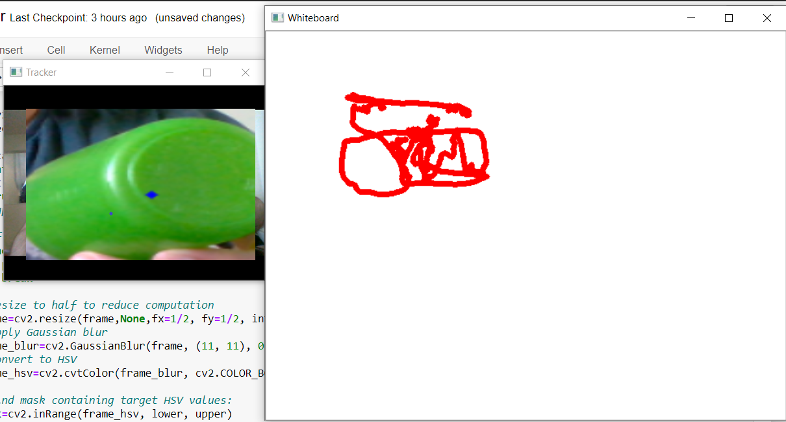

The program reads frames from webcam, traces object chosen as 'pen'.
The centroid of the 'pen' is traced in another window with white background, giving the effect of a drawing board.

FOr example, below snip from video:

Dependencies:
Numpy
Opencv

Current Limitation:
The user needs to input the HSV range of 'pen'

Todo:
1. Add mouseclick event driven code to extract HSV range of object from webcam stream
2. Add exponential smoothening on the centroid values to remove sharp movements due to natural shaking of hand, needs trial and error.
3. User selects region, which is used for template matching to identify pen, instead of purely HSV based thresholding